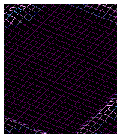
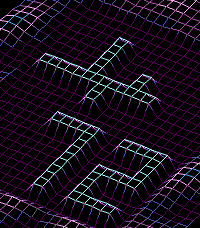
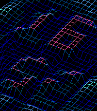
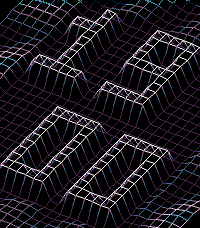
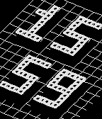
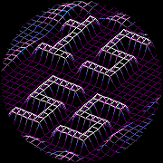

# FdF Time

A [Pebble](https://repebble.com/) watchface that renders the time as a 3D
wireframe heightmap. **FdF** is short for *fil de fer*, French for wireframe,
and the name of École 42's rank-2 project whose demo map extrudes "42" out of
a flat terrain. Here the terrain grows the current time instead, and it can
roll to the rhythm of your pulse.

**Get it:** [Pebble Appstore](https://apps.repebble.com/0e2670c1adae469783030d49)
(new Pebble app) · [Rebble store](https://apps.rebble.io/en_US/application/6a7dcbb1a2b290000911d59c)
(legacy ecosystem)

  

| basalt (color) | emery (real Pebble Time 2) | diorite (1-bit) | chalk (round) |
|---|---|---|---|
|  |  |  |  |

## Features

- **HH / MM staggered** as flat-top plateaus (2-cell-thick strokes, exactly
  the style of the original `42.fdf` map), on a living wireframe terrain —
  an ocean swell rolls around the digits.
- **Draw your own terrain.** The settings page carries a full pixel editor
  for the 22×25 grid: sketch cell by cell, or type an emoji or a short word
  and have it traced into the grid for you, then tidy it by hand. The
  drawing rises out of the ocean at launch, or on a wrist flick. A fresh
  install ships with one already drawn rather than an empty grid.
- **A heart-rate scene.** A medical-monitor ECG strip scrolls across the
  terrain in time with your beats — its period comes from real HRV
  peak-to-peak intervals, not an average — with your BPM built out of the
  same landscape and the whole scene tinted by rate. Needs a watch with the
  optical sensor; elsewhere the gesture falls back to the orbit.
- **An ocean that follows your pulse.** The *Pulse* wave mode advances the
  swell one wavelength per 30 beats, read from the firmware's own
  duty-cycled measurement, so it costs no extra battery and never opens a
  sensor request of its own. It is the default, and degrades to exactly
  *Silk* when there is no reading.
- **Seven colour themes**, hand-quantized ports of popular editor schemes:
  Catppuccin (default), Dracula, Gruvbox, Kanagawa, Matrix, Nord, Tokyo
  Night. Everything derives from the theme: floor, walls (FdF-style
  per-vertex gradients), wave crests, morph sweep, digit tops.
- **Morph animation**: on each minute change, old digits melt into the
  terrain while the new ones rise through the theme's colour ramp.
- **Wrist-flick scenes**: the orbit spin (a full turn of the camera, the FdF
  rotation bonus), your drawing, the seconds, today's date, the battery as a
  drawn gauge, or the heart-rate strip.
- **Low-battery alert** that raises the battery scene by itself at the same
  thresholds PebbleOS uses (12% then 8%), once per step, never while
  charging, and deliberately without a vibration since the firmware already
  buzzes.
- Runs on all 7 platforms: `aplite`, `basalt`, `chalk`, `diorite`, `emery`,
  `flint`, `gabbro`.

## How it works

Pure integer math, no floats — friendly to the FPU-less Cortex-M3:

- Trimetric projection tuned for a portrait watch screen: the digit-row axis
  slopes a gentle 22° (readable baseline), the HH/MM stack axis is picked at
  init (~60–70°) to fill the screen height, and a terrain "bleed" ring
  overflows the edges so the mesh reaches the corners. All axes are
  1024-scale fixed-point vectors.
- Rotation uses the SDK's `sin_lookup`/`cos_lookup` fixed-point trig.
- Time digits come from a 3×5 bitmap font scaled ×2 into the heightmap
  (inner 22×25 region plus the bleed ring); the whole transform chain
  (center → rotate → project) recomputes from the pristine grid every frame,
  FdF-style.
- Legibility at watch resolution comes from visual hierarchy: plateau-top
  edges (the digit outlines) take the theme's foreground colour, walls fade
  through a capped per-vertex gradient anchored dark at the floor, and the
  base mesh stays a "visible dark" in the theme's dominant hue (walls are
  dropped and tops bolded on 1-bit displays).
- Two rules govern every shape this renderer draws, and the emoji/text
  rasterizer now enforces both rather than hoping for them: cells touching
  only at a corner share no edge and render as floating blocks (formally,
  the grid must be *well-composed*), and anything thinner than two cells is
  illegible. The stamp pipeline thresholds, carves details by region, welds
  corner-only links and thickens thin strokes to satisfy them.

## Install on your watch

With the current Pebble mobile app ([repebble.com/app](https://repebble.com/app)):

1. In the app: **Devices → ⋯ → Enable Dev Connect**, sign in with GitHub.
2. On your computer: `pebble login` (same GitHub account).
3. `pebble install --phone` — no IP needed, the connection is relayed.

## Dev environment (NixOS / Nix + devenv)

The toolchain is reproducible via [devenv](https://devenv.sh/) +
[direnv](https://direnv.net/). The Pebble SDK ships prebuilt FHS binaries
(ARM toolchain, QEMU emulator), so on NixOS every `pebble` command runs
transparently inside a `buildFHSEnv` bubblewrap wrapper — no `nix-ld` or
system configuration needed.

### First-time setup

```sh
direnv allow        # or: devenv shell
pebble-setup        # installs pebble-tool (via uv) + SDK core + ICU fix
```

### Daily workflow

```sh
pebble build                        # build the .pbw for all platforms
pebble install --emulator basalt    # run in the QEMU emulator
pebble emu-tap --emulator basalt    # trigger the orbit animation
pebble screenshot --emulator basalt # grab a screenshot
pebble kill                         # stop emulators
```

## Project layout

```
src/c/main.c        app lifecycle, ticks, morph/spin, scenes, settings
src/c/fdf.c/.h      heightmap model, integer trimetric pipeline, wireframe render
src/c/digits.h      3x5 digit font
src/pkjs/config.js  Clay settings page
src/pkjs/pixel-grid.js  the 22x25 drawing editor + emoji/text rasterizer
tools/              store pipeline: capture, cut, upload, listing automation
store-assets/       what is currently published (per-platform GIFs, icons)
package.json        Pebble app manifest (uuid, platforms, message keys)
wscript             waf build script (standard Pebble template)
devenv.nix          reproducible dev environment + FHS wrapper + pebble scripts
.claude/skills/     Core Devices' pebble-watchface skill for Claude Code
```

## Resources

- [École 42](https://42.fr/) — FdF is a rank-2 project of the common core;
  see this [community guide](https://42-cursus.gitbook.io/guide) for context
- [kurval/42-fdf](https://github.com/kurval/42-fdf) — reference FdF
  implementation studied for the pipeline
- [Pebble developer docs](https://developer.repebble.com/) — API reference,
  tutorials
- [Framebuffer & drawing guide](https://developer.repebble.com/guides/graphics-and-animations/framebuffer-graphics/)
- [pebble-watchface-agent-skill](https://github.com/coredevices/pebble-watchface-agent-skill)
  (© Core Devices, vendored under `.claude/skills/`)

This project was built in pair with Claude Code — research, code, and the
emulator-driven design iterations are documented in `CLAUDE.md`.

## Notes / gotchas

- **Do not export `CC`/`AR`/`LD` into pebble builds**: waf gives ambient `CC`
  priority over the SDK's `arm-none-eabi-gcc`. The FHS wrapper unsets them.
- The STPyV8 ICU seed (done by `pebble-setup`) works around a read-only
  `/usr/share` inside the FHS environment.
- Antialiasing is enabled today (cells are ~6 px since the trimetric
  projection); it was disabled at the earlier, denser grid where it smeared
  1 px lines into noise. If the grid ever gets denser again, revisit.
- **Altitude cannot encode a value.** One altitude step is about a pixel, so
  a "gauge by height" reads as a tilted plate lost in the swell. Only two
  things read at this density: the footprint of a full-height plateau, and
  the palette colour. Design new scenes as shapes, not reliefs.

## License

MIT — see [LICENSE](LICENSE). The vendored Claude Code skill under
`.claude/skills/pebble-watchface/` is © Core Devices and distributed under
its own terms (provided for creating Pebble watchfaces).
