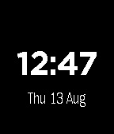

# pebble-watchface

A watchface for [Pebble](https://repebble.com/) smartwatches, built with the modern
(2026, Core Devices) Pebble C SDK. Currently a clean minimal face: big time,
date below, white on black.



Targets all current platforms: `aplite`, `basalt`, `chalk`, `diorite`, `emery`,
`flint`, `gabbro` (Pebble Classic through Pebble Time 2 / Core Devices hardware).

## Dev environment (NixOS / Nix + devenv)

The whole toolchain is reproducible via [devenv](https://devenv.sh/) and
[direnv](https://direnv.net/). The Pebble SDK ships prebuilt FHS binaries
(ARM toolchain, QEMU emulator), so on NixOS every `pebble` command runs
transparently inside a `buildFHSEnv` bubblewrap wrapper — no `nix-ld` or system
configuration needed.

### First-time setup

```sh
direnv allow        # or: devenv shell
pebble-setup        # installs pebble-tool (via uv) + SDK core + ICU fix
```

`pebble-setup` is a one-shot bootstrap. It installs everything under
`.devenv/state/uv/` (project-local) and `~/.local/share/pebble-sdk/` (SDK core).

### Daily workflow

```sh
pebble build                        # build the .pbw for all platforms
pebble install --emulator basalt    # run in the QEMU emulator
pebble screenshot --emulator basalt # grab a screenshot
pebble logs --emulator basalt       # tail app logs
pebble kill                         # stop emulators
```

Emulator platform names: `aplite` (Pebble Classic), `basalt` (Pebble Time),
`chalk` (Time Round), `diorite` (Pebble 2), `emery` (Time 2), `flint`
(Core 2 Duo), `gabbro`.

To install on a real watch through the phone app:

```sh
pebble install --phone <PHONE_IP>
```

## Project layout

```
src/c/main.c     watchface source (C SDK)
package.json     Pebble app manifest (uuid, platforms, resources)
wscript          waf build script (standard Pebble template)
devenv.nix       reproducible dev environment + FHS wrapper + pebble scripts
.claude/skills/  Core Devices' pebble-watchface skill for Claude Code
```

## Resources

- [Pebble developer docs](https://developer.repebble.com/) — API reference, tutorials
- [Watchface tutorial](https://developer.repebble.com/tutorials/watchface-tutorial/part1/)
- [SDK installation guide](https://developer.repebble.com/sdk/)
- [pebble-watchface-agent-skill](https://github.com/coredevices/pebble-watchface-agent-skill)
  (© Core Devices, vendored under `.claude/skills/`)
- [Rebble Discord](https://rebble.io/discord) — community help

## Notes / gotchas

- **Do not export `CC`/`AR`/`LD` into pebble builds**: waf gives ambient `CC`
  priority over the SDK's `arm-none-eabi-gcc`. The FHS wrapper unsets them.
- The STPyV8 ICU seed (done by `pebble-setup`) works around a read-only
  `/usr/share` inside the FHS environment.
- `build/` is disposable; `rm -rf build` for a clean rebuild.
